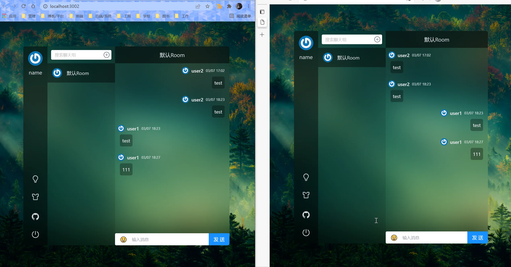
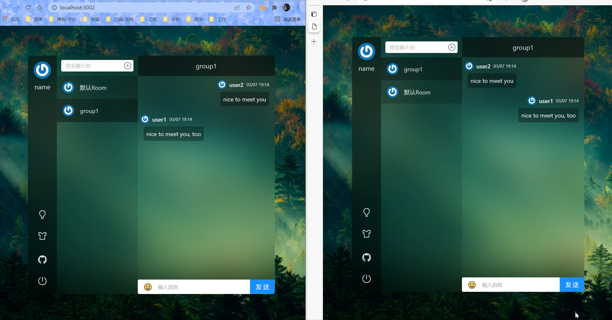

### 项目简介
本项目是出于学习目的构建的即时通讯（IM）程序。

**项目管理**
* 使用 pnpm 建立Monorepo，管理依赖
* 全部采用TypeScript进行编写

**前端**
* react+hooks
* react-query 服务端缓存、乐观更新
* react-router 切换路由
* tailwindcss 完成样式
* vitejs 完成开发编译

**服务端**
* nestjs 作为后端服务
* sqlite 数据库
* prisma 作为数据库ORM
* webSocket 通信

**部署**
* docker-compose 完成部署

### 效果预览

**新建群聊**

**emoji、图片支持**

